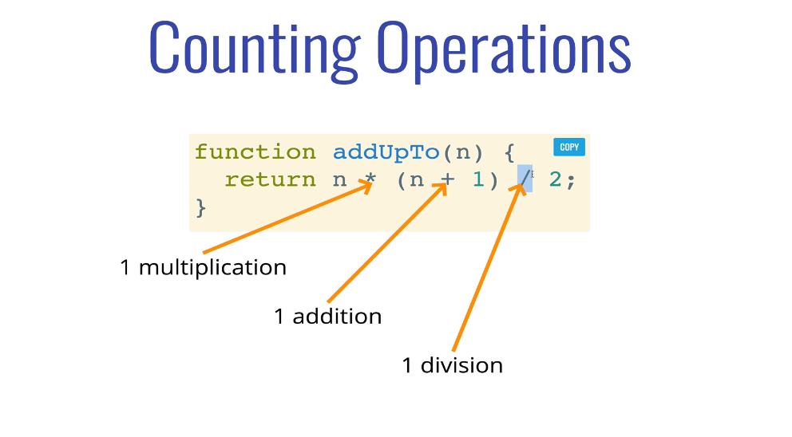
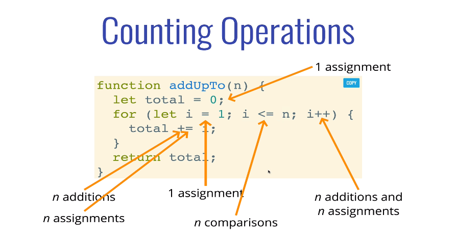
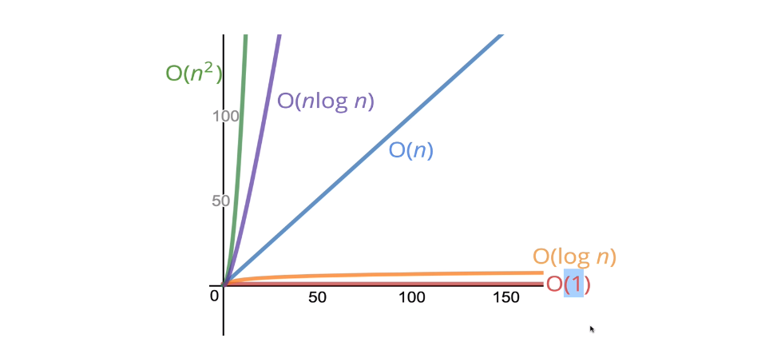

# Big O Notation

* To analyze the performance of an algorithm, we use Big O Notation 
* Big O Notation can give us a high level understanding of the time or space complexity of an algorithm 
* Big O Notation doesn't care about precision, only about general trends (linear? quadratic? constant?)
* The time or space complexity (as measured by Big O) depends only on the algorithm, not the hardware used to run the algorithm

### Why Big O Notation?
* It's important to have a precise vocabulary to talk about how our code performs
* Useful for discussing trade-offs between different approaches
* When your code slows down or crashes, identifying parts of the code that are inefficient can help us find pain points in our applications.

### Sample program to compare efficiency
```js
function addUpTo(n) {
  let total = 0;
  for (let i = 1; i <= n; i++) {
  total += i;
  }
  return total;
}

let time1 = performance.now();
console. log(addUpTo(1000000000));
let time2 = performance.now();

console.log(`Time Lapsed: ${(time2 - time1)/1000} seconds.`)
```

```js
function addUpTo(n) {
  return n * (n+1) / 2;
}

let time1 = performance.now();
console. log(addUpTo(1000000000));
let time2 = performance.now();

console.log(`Time Lapsed: ${(time2 - time1)/1000} seconds.`)
```

> It is not ideal to compare 2 programs with time. So efficiency way to measure performance is counting number of Operations

### Counting Operations
**Efficient**
> Counting the number of simple operations the computer has to perform in a given code snippet or function.



**Not Efficient**



### Performance Tracker

[Function Timer](https://rithmschool.github.io/function-timer-demo)

### Nerdy Big O Notation
We say that an algorithm is **O(f(n))** if the number of simple operations the computer has to do is eventually less than a constant times **f(n)**, as **n** increases

* f(n) could be linear (f(n) = n)
* f(n) could be quadratic (f(n) = n²)
* f(n) could be constant (f(n) = 1)
* f(n) could be something entirely different!

**O(1)**

> Always 3 Operations

```js
function addUpTo(n) {
  return n * (n+1) / 2;
}
```

**O(n)**

>  Number of operations is (eventually) bounded by a multiple of n (say, 10n)

```js
function addUpTo(n) {
  let total = 0;
  for (let i = 1; i <= n; i++) {
  total += i;
  }
  return total;
}
```

**O(n<sup>2</sup>)**
```js
 function printAllPairs (n) {
    for (var i = 0; i < n; i++) { //O(n)
        for (var j = 0; j < n; j++) { //O(n)
            console.log(i, j);
        }
    }
}
```

### Simplifying Big O Expressions

**Constants don't matter**

O(2n) === O(n)

O(500) === O(1)

O(13n<sup>2</sup>) === O(n<sup>2</sup>)

**Smaller Terms don't matter**

O(n + 10) === O(n)

O(1000n + 50) === O(n)

O(n<sup>2</sup> + 5n + 8) === O(n<sup>2</sup>)

**Tiny Rules**

1. Arithmetic operations are constant
2. Variable assignment is constant
3. Accessing elements in an array (by index) or object (by key) is constant
4. In a loop, the complexity is the length of the loop times the complexity of whatever happens inside the loop

### Visual Representation of Run Time Complexity



### Space Complexity with Big O

> Amount of space occupied by a given algorithm. 

* Most primitives (booleans, numbers, undefined, null) are constant space
* Strings require O(n) space (where n is the string length)
* Reference types are generally O( n), where n is the length (for arrays) or the number of keys (for objects)

### Logarithmic Representation of Big O

**What is a Log**

>  The logarithm of a number roughly measures the number of times you can divide that number by 2 before you get a value that's less than or equal to one.

log<sub>2</sub>(8) === 3 -----> 2<sup>3</sup> === 8

log === log<sub>2<sub>

> Logarithmic time complexity of an algorithm is Great!!!

**UseCases of Logarithmic Time Complexity**

* Certain searching algorithms have logarithmic time complexity.
* Efficient sorting algorithms involve logarithms.
* Recursion sometimes involves logarithmic space complexity.
